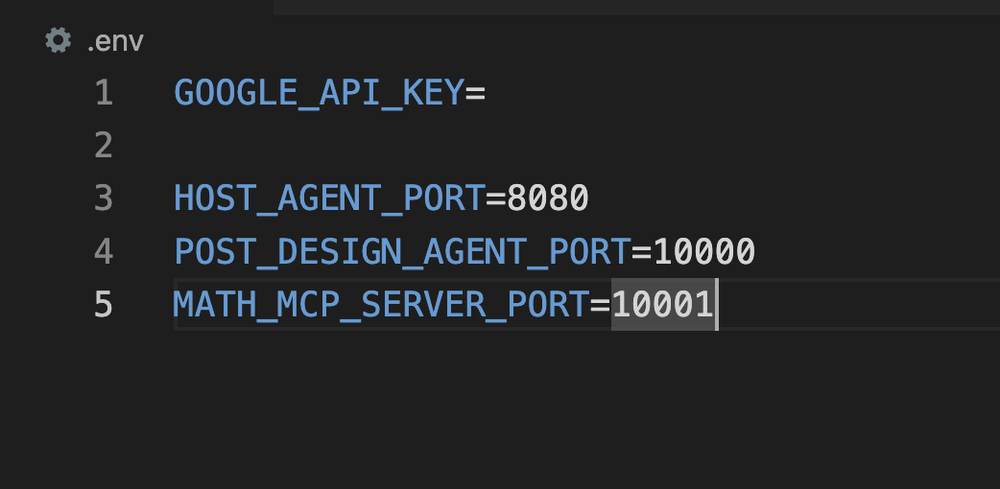
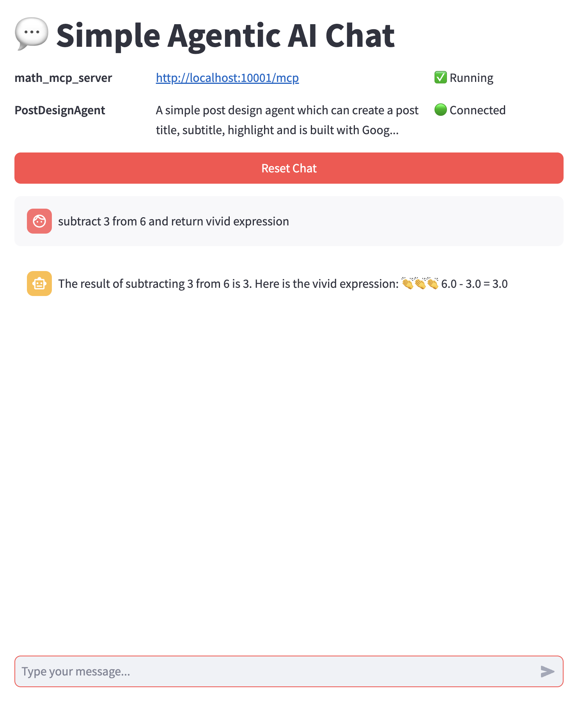
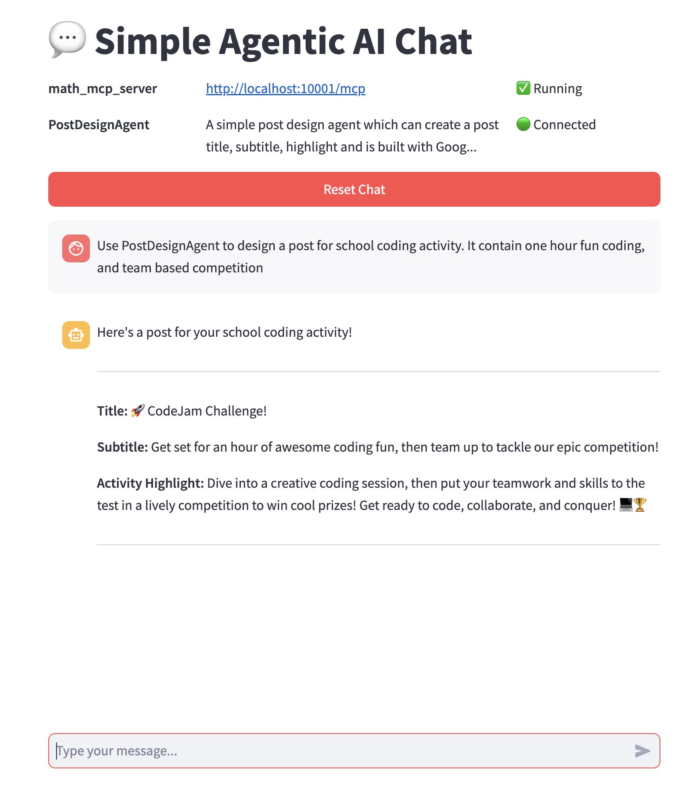

## MCP + A2A Agentic AI Sample Project

- create host agent (http://localhost:8080)
- create one functional agent (post_design_agent) (http://localhost:10000)
- create one mcp server (math_mcp_server) (http://localhost:10001)
- create a command interaction program to send message to the host agent and get response
- Create a simple UI (streamlit) to send message to the host agent and get response

## How to Run

1. Ensure your machine installs uv
2. Open project in VSCode. Switch the project root path as current working path
3. Type "uv sync"
4. Type "source .venv/bin/activate"
5. Input GOOGLE_API_KEY to .env file (Acquire key from https://aistudio.google.com/apikey, other settings could keep unchanged)
   
6. Type "make run-all" to start all the programs. Check this YouTube video: https://youtu.be/6NseOUOZbss
7. In the opened browser window, try the agentic AI. (note: there are one PostDesignAgent and one math-mcp-server. If the host agent could not find useful tool, it will not use any tool and reply to you directly)

  
   
  

## TODO:

- add more agents and mcp server
- wrap them in containers
